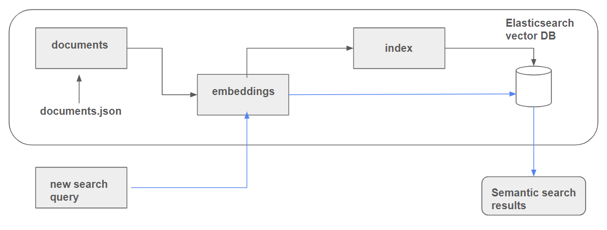

# Semantic Search using Elastic Search

### Concepts

Two very important concepts in Elasticsearch are documents and indexes.
1. A document is collection of fields with their associated values. 
2. To work with Elasticsearch you have to organize your data into documents, and then add all your documents to an index. 

**Note**: _Index as a collection of documents that is stored in a highly optimized format designed to perform efficient searches._

### Architecture

